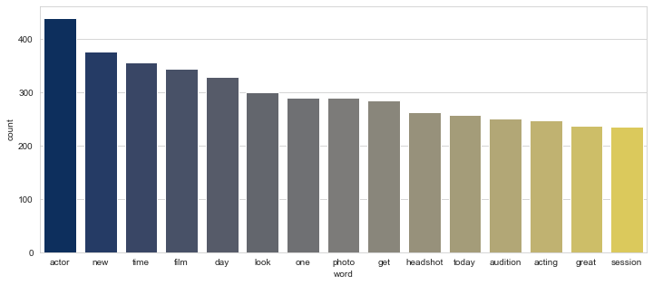
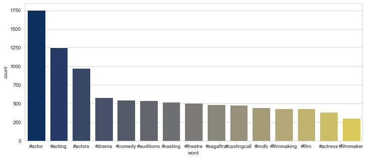
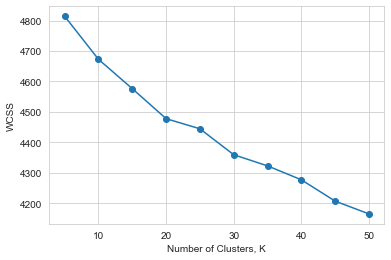
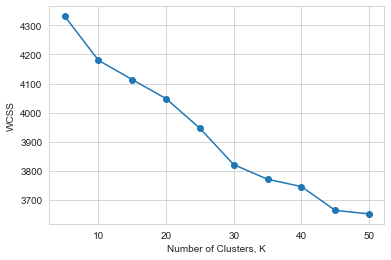
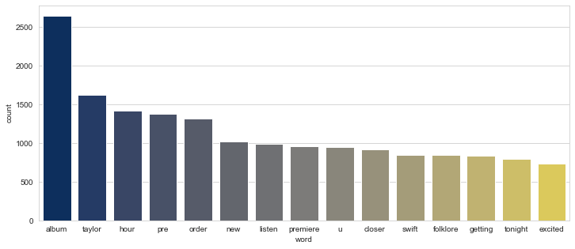
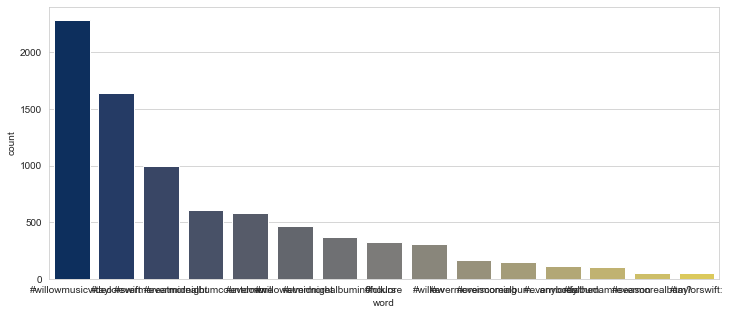
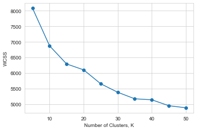
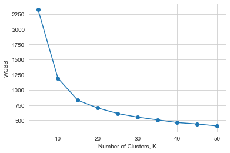

Project Description:

I am interested in clustering tweets in an effort to understand what topics people are currently talking about. I have gathered up to date twitter data from a variety of hashtags that I will perform a K-Means cluster analysis on. My hope is to find distinct clusters that may provide some insight into the current topics that people are tweeting about. The tweets I have gathered were based on certain hashtags that I am interested in and in areas that I am somewhat familiar with so the resulting topics will hopefully be recognizable. If I was interested in different categories of hashtags this analysis would also allow me the versatility to cluster tweet data collected from different hashtags. 

Data Collection:

I used the tweepy package to access Twitter's API and collect all of the data for this project. I used tweepy's api.search method which returns a limited amount of tweets that match the searched query. The searches I used were hashtags and in general I tried to gather all of the tweets which contained that hashtag that occurred within the past two weeks. Because of the limitations on the API search method my analysis only includes hashtags where I was able to collect around 5,000 tweets.

Note that in order to access Twitters API through tweepy you must have a Twitter account, and a Twitter developer account. The developer account can be applied for [here](https://developer.twitter.com/en/apply-for-access).

After successfully creating a Twitter developer account you can access the proper keys and tokens which are required to access the Twitter API through tweepy. There are many tutorials out there that show how to go about accessing Twitter's API using tweepy.

Data Description:

The data that I used for this project consisted mainly of the text maintained within the tweets. The process I used to clean the text was as follows. I first removed all hyperlinks, hashtags, mentions, digits, and anything that was not in the alphabet from the text (i.e. special characters or emojis). Then, I tokenized the words using ntlk's word_tokenize function. I removed all the words that were not in the defined stop words list. Finally I used nltk's WordNetLemmatizer to lemmatize the remaining words. After the text data went through this cleaning process it was ready for analysis. 

I also removed the hashtags from the text data and created another feature containing all hashtags in a given tweet for additional analysis.  

Methods:

For this project I am using a KMeans model to cluster the collected Twitter text data. The reason I chose to use a KMeans is simply because it is one of the only unsupervised learning methods I am currently familiar with. I am not entirely sure at how well KMeans does on text data, this is one of my first projects with clustering text.

### Begin


```python
import pandas as pd
import numpy as np
import re
import matplotlib.pyplot as plt
import seaborn as sns
sns.set_style('whitegrid')
from nltk import wordpunct_tokenize, word_tokenize, sent_tokenize
from nltk.stem import WordNetLemmatizer
from nltk.util import ngrams
from nltk.corpus import stopwords
from collections import Counter
from sklearn.cluster import KMeans, MiniBatchKMeans
from sklearn.feature_extraction.text import TfidfVectorizer
pd.options.display.max_colwidth = 500
```

Stop words were taken from the ntlk corpus with additional words added to the list that appeared frequently but did not add value to the text.


```python
sw = stopwords.words('english')
# Append rt (Retweet), rts (Retweets), u (you), amp (& character), and empty characters to the list of stop words
sw.extend(['rt', 'rts', 'u', 'amp', ''])
```

# Here I begin my analysis on tweet data gathered from the #actorslife hashtag.

### Word Count on Text


```python
actorslife = pd.read_csv('actorslife_hashtag.csv')
```

The data I'm using contains the date, id, and full text of a tweet. 


```python
actorslife.info()
```

    <class 'pandas.core.frame.DataFrame'>
    RangeIndex: 5303 entries, 0 to 5302
    Data columns (total 3 columns):
    Datetime    5303 non-null object
    Tweet Id    5303 non-null int64
    Text        5303 non-null object
    dtypes: int64(1), object(2)
    memory usage: 124.4+ KB


```python
actorslife.head(3)
```


<table border="1" class="dataframe">
  <thead>
    <tr style="text-align: right;">
      <th></th>
      <th>Datetime</th>
      <th>Tweet Id</th>
      <th>Text</th>
    </tr>
  </thead>
  <tbody>
    <tr>
      <td>0</td>
      <td>2020-12-10 17:10:50</td>
      <td>1337082356331528192</td>
      <td>Let me book one job this year please please please 🙏🏽✨🙌🏽🥲 I mean...even I’m impressed by my range here. 🤓\n#actorslife #asianactress https://t.co/lKzJml91mL</td>
    </tr>
    <tr>
      <td>1</td>
      <td>2020-12-10 17:10:14</td>
      <td>1337082208012693509</td>
      <td>BILLION STAR HOTEL by Alecs Nastoiu A touching story about a little homeless boy, learns how things are going in real life, from his mentor, Papa Rudi. CLICK HERE=&amp;gt; https://t.co/E7FQG7kUXJ #cinematographer #cinematography #dop #dp #director #actor #actress #actorslife #filmmaker https://t.co/ZEP5LRjBau</td>
    </tr>
    <tr>
      <td>2</td>
      <td>2020-12-10 17:10:11</td>
      <td>1337082195698126853</td>
      <td>📷 https://t.co/GQb23bDAX6 Please check out my interview with great actor/director/producer Robert Amico for Eye on Entertainment! Filmed and edited by Dr. Renah Wolzinger! ❤️ #setlife #actorslife #producer #picoftheday #photooftheday... https://t.co/gVSHMHUBT1</td>
    </tr>
  </tbody>
</table>
</div>


This function finds and removes strings which begin with a given substring from the text. It is used to remove hyperlinks, hashtags, and mentions.


```python
def removeSubstring(substringList, string):
    stringList = re.split(' |\n', string)
    for substring in substringList:
        result = [i for i in stringList if substring in i]
        for string in result:
            stringList.remove(string)
    return " ".join(stringList)
```

This Function processes and cleans text from a tweet. It takes the text as input then does the following: lowercases, lemmatizes, removes hyperlinks, removes hashtags, removes mentions, removes digits, and removes any stop words found in the text.


```python
def wc_text_processor(x):
    wn = WordNetLemmatizer()
    x = x.lower()
    # remove all https://hyperlinks, #hashtags, and @mentions from the text
    x = removeSubstring(['http://', 'https://', '#', '@'], x)
    # remove all digits from the text
    x = re.sub('\w*\d\w*','', x)
    tokens = wordpunct_tokenize(x)
    # remove words/characters that are not alphanumeric and words/characters that are in the stop words list
    tokens = [tok for tok in tokens if tok.isalnum()]
    tokens = [tok for tok in tokens if tok not in sw]
    tokens = [wn.lemmatize(tok) for tok in tokens]
    return(tokens)
```


```python
actorslife_text = actorslife['Text'].apply(wc_text_processor)
```

After processing the text we have a clean list of words ready to be used for analysis.


```python
actorslife_text.head(3)
```


    0                                                                  [let, book, one, job, year, please, please, please, mean, even, impressed, range]
    1    [billion, star, hotel, alecs, nastoiu, touching, story, little, homeless, boy, learns, thing, going, real, life, mentor, papa, rudi, click, gt]
    2              [please, check, interview, great, actor, director, producer, robert, amico, eye, entertainment, filmed, edited, dr, renah, wolzinger]
    Name: Text, dtype: object


Now that we have the text cleaned and ready we can do a simple word count. The following function will add all the words into one big list, then use the collections.Counter function to count all words in the text. Afterwords it plots a simple graph of the first few words ordered by frequency. 


```python
# Counts the words in the text after it has been processed 
def word_count(text):
    all_text = []
    for words in text:
        all_text += words
    c = Counter(all_text)
    
    wc = pd.DataFrame(c.items(), columns=['word','count'])
    wc.sort_values(by='count',ascending=False).head(15)
    for_plot = wc.sort_values(by='count',ascending=False).head(15)
    plt.figure(figsize=(12,5))
    sns.barplot(x='word', y='count',data=for_plot, palette='cividis')
    return wc.sort_values(by='count',ascending=False).head(15)
```


```python
word_count(actorslife_text)
```





Here we can see that the top five highest frequency words are actor, new, time, film, and day. These words do make sense when we recognize that the text data is coming from the #actorslife hashtag. 

Another thing I've done on top of word count was to also count bigrams and trigrams within the text. This applies the ngrams function from nltk and then uses the same collections.Counter function to count the bigrams/trigrams.


```python
# Counts the bigrams in the text after it has been processed
def word_count_bigrams(text):
    all_text = []
    for words in text:
        all_text += words
    bigrams = ngrams(all_text, 2)
    c = Counter(bigrams)
    bic = pd.DataFrame(c.items(), columns=['word','count'])
    return bic.sort_values(by='count',ascending=False).head(10)
```


```python
# Counts the trigrams in the text after it has been processed
def word_count_trigrams(text):
    all_text = []
    for words in text:
        all_text += words
    trigrams = ngrams(all_text, 3)
    c = Counter(trigrams)
    bic = pd.DataFrame(c.items(), columns=['word','count'])
    return bic.sort_values(by='count',ascending=False).head(10)
```


```python
word_count_bigrams(actorslife_text)
```


<table border="1" class="dataframe">
  <thead>
    <tr style="text-align: right;">
      <th></th>
      <th>word</th>
      <th>count</th>
    </tr>
  </thead>
  <tbody>
    <tr>
      <td>2195</td>
      <td>(session, look)</td>
      <td>207</td>
    </tr>
    <tr>
      <td>2194</td>
      <td>(photo, session)</td>
      <td>206</td>
    </tr>
    <tr>
      <td>2193</td>
      <td>(headshot, photo)</td>
      <td>206</td>
    </tr>
    <tr>
      <td>4336</td>
      <td>(look, headshot)</td>
      <td>135</td>
    </tr>
    <tr>
      <td>1768</td>
      <td>(checked, website)</td>
      <td>104</td>
    </tr>
    <tr>
      <td>148</td>
      <td>(self, tape)</td>
      <td>100</td>
    </tr>
    <tr>
      <td>1041</td>
      <td>(checked, imdb)</td>
      <td>77</td>
    </tr>
    <tr>
      <td>1042</td>
      <td>(imdb, page)</td>
      <td>74</td>
    </tr>
    <tr>
      <td>419</td>
      <td>(short, film)</td>
      <td>60</td>
    </tr>
    <tr>
      <td>1516</td>
      <td>(feature, film)</td>
      <td>52</td>
    </tr>
  </tbody>
</table>
</div>


```python
word_count_trigrams(actorslife_text)
```


<table border="1" class="dataframe">
  <thead>
    <tr style="text-align: right;">
      <th></th>
      <th>word</th>
      <th>count</th>
    </tr>
  </thead>
  <tbody>
    <tr>
      <td>2384</td>
      <td>(photo, session, look)</td>
      <td>206</td>
    </tr>
    <tr>
      <td>2383</td>
      <td>(headshot, photo, session)</td>
      <td>206</td>
    </tr>
    <tr>
      <td>4761</td>
      <td>(look, headshot, photo)</td>
      <td>135</td>
    </tr>
    <tr>
      <td>4760</td>
      <td>(session, look, headshot)</td>
      <td>135</td>
    </tr>
    <tr>
      <td>1090</td>
      <td>(checked, imdb, page)</td>
      <td>73</td>
    </tr>
    <tr>
      <td>2326</td>
      <td>(checked, website, checked)</td>
      <td>45</td>
    </tr>
    <tr>
      <td>14427</td>
      <td>(clothing, unlimited, believe)</td>
      <td>39</td>
    </tr>
    <tr>
      <td>14426</td>
      <td>(heart, clothing, unlimited)</td>
      <td>39</td>
    </tr>
    <tr>
      <td>14425</td>
      <td>(thespian, heart, clothing)</td>
      <td>39</td>
    </tr>
    <tr>
      <td>451</td>
      <td>(la, lake, view)</td>
      <td>37</td>
    </tr>
  </tbody>
</table>
</div>


We can see from these results that some of the words are more commonly used together such as session and look, photo and session, headshot and photo, look and headshot, checked and website. This could show that when people are tweeting and they mention some kind of session they are often asking people to also look at the results from the session. Also we can see that these sessions are usually related to photos or headshots. It appears from these bigrams and trigrams that when people are tweeting in the #actorslife hashtag and they are using words like session, they are also referring to a photo or a headshot and inviting others to look at their content. 

### Word Count on Hashtags

Another feature we can look at from this data are the hashtags themselves. The following function takes the original text and returns a list of all the hashtags used within that text. I can then use this list to create a separate feature to analyze. 


```python
# Return a list of hashtags that are contained in the text 
def getHashtags(string):
    string = string.lower()
    hashtagList = []
    stringList = re.split(' |\n', string)
    result = [i for i in stringList if '#' in i]
    for string in result:
        hashtagList.append(string)   
    return hashtagList
```


```python
actorslife['Hashtags'] = actorslife['Text'].apply(getHashtags)
```


```python
actorslife['Hashtags'].head(2)
```


    0                                                                            [#asianactress]
    1    [#cinematographer, #cinematography, #dop, #dp, #director, #actor, #actress, #filmmaker]
    Name: Hashtags, dtype: object


Because we are using tweets that are results of the #actorslife search we can assume all of our tweets have the #actorslife hashtag in them, so we can take it out since it won't be beneficial in our analysis. 


```python
actorslife['Hashtags'].apply(lambda x : x.remove('#actorslife') if ('#actorslife' in x) else x).head(3)
```


    0                                                                            [#asianactress]
    1    [#cinematographer, #cinematography, #dop, #dp, #director, #actor, #actress, #filmmaker]
    2                                     [#setlife, #producer, #picoftheday, #photooftheday...]
    Name: Hashtags, dtype: object


```python
actorslife['Hashtags'].head(2)
```


    0                                                                            [#asianactress]
    1    [#cinematographer, #cinematography, #dop, #dp, #director, #actor, #actress, #filmmaker]
    Name: Hashtags, dtype: object


Now we can perform a word count on the hashtags to find out which hashtags are most frequently used with the #actorslife hashtag.


```python
word_count(actorslife['Hashtags'])
```





A majority of people using the #actorslife hashtag also use the #actor, #acting, and #actors hashtags. This is also sensible considering that actor, actors, and acting are all words which can be considered closely realted to actorslife. Knowing which hashtags are used within a tweet along with the word count could possibly be used to gain greater insight into what the topic of the text is. 

### KMeans on Text

The text needs to be in a slightly different form than what it was for the earlier word count. This function processes the text in a way that is similar to preprocessing for word count, but in the end it returns on string value containing the resultling words instead of a list of resulting words. 


```python
# Function for processing text before vectorization
def tfidf_text_processor(x):
    wn = WordNetLemmatizer()
    x = x.lower()
    # remove all https://hyperlinks, #hashtags, and @mentions from the text
    x = removeSubstring(['http://', 'https://', '#', '@'], x)
    # remove all digits from the text
    x = re.sub('\w*\d\w*','', x)
    tokens = wordpunct_tokenize(x)
    # remove words/characters that are not alphanumeric and words/characters that are in the stop words list
    tokens = [tok for tok in tokens if tok.isalnum()]
    tokens = [tok for tok in tokens if tok not in sw]
    tokens = [wn.lemmatize(tok) for tok in tokens]
    return ' '.join(tokens)
```


```python
actorslife.head(3)
```


<table border="1" class="dataframe">
  <thead>
    <tr style="text-align: right;">
      <th></th>
      <th>Datetime</th>
      <th>Tweet Id</th>
      <th>Text</th>
      <th>Hashtags</th>
      <th>CleanHashtags</th>
    </tr>
  </thead>
  <tbody>
    <tr>
      <td>0</td>
      <td>2020-12-10 17:10:50</td>
      <td>1337082356331528192</td>
      <td>Let me book one job this year please please please 🙏🏽✨🙌🏽🥲 I mean...even I’m impressed by my range here. 🤓\n#actorslife #asianactress https://t.co/lKzJml91mL</td>
      <td>[#asianactress]</td>
      <td>#asianactress</td>
    </tr>
    <tr>
      <td>1</td>
      <td>2020-12-10 17:10:14</td>
      <td>1337082208012693509</td>
      <td>BILLION STAR HOTEL by Alecs Nastoiu A touching story about a little homeless boy, learns how things are going in real life, from his mentor, Papa Rudi. CLICK HERE=&amp;gt; https://t.co/E7FQG7kUXJ #cinematographer #cinematography #dop #dp #director #actor #actress #actorslife #filmmaker https://t.co/ZEP5LRjBau</td>
      <td>[#cinematographer, #cinematography, #dop, #dp, #director, #actor, #actress, #filmmaker]</td>
      <td>#cinematographer #cinematography #dop #dp #director #actor #actress #filmmaker</td>
    </tr>
    <tr>
      <td>2</td>
      <td>2020-12-10 17:10:11</td>
      <td>1337082195698126853</td>
      <td>📷 https://t.co/GQb23bDAX6 Please check out my interview with great actor/director/producer Robert Amico for Eye on Entertainment! Filmed and edited by Dr. Renah Wolzinger! ❤️ #setlife #actorslife #producer #picoftheday #photooftheday... https://t.co/gVSHMHUBT1</td>
      <td>[#setlife, #producer, #picoftheday, #photooftheday...]</td>
      <td>#setlife #producer #picoftheday #photooftheday...</td>
    </tr>
  </tbody>
</table>
</div>


```python
actorslife_text = actorslife['Text'].apply(tfidf_text_processor)
```


```python
actorslife_text.head(3)
```


    0                                                          let book one job year please please please mean even impressed range
    1    billion star hotel alecs nastoiu touching story little homeless boy learns thing going real life mentor papa rudi click gt
    2          please check interview great actor director producer robert amico eye entertainment filmed edited dr renah wolzinger
    Name: Text, dtype: object


Now we set up our TFIDF Vectorizer and call the fit_transform method on our data. This transformation converts the text into a vector of numerical values which can now be used to fit a KMeans model. 


```python
tf_actorslife = TfidfVectorizer()
```


```python
X_actorslife = tf_actorslife.fit_transform(actorslife_text)
```


```python
pd.DataFrame(X_actorslife.toarray(), columns=tf_actorslife.get_feature_names()).head(3)
```


<table border="1" class="dataframe">
  <thead>
    <tr style="text-align: right;">
      <th></th>
      <th>aaand</th>
      <th>aamir</th>
      <th>aapke</th>
      <th>aba</th>
      <th>abba</th>
      <th>abbey</th>
      <th>abc</th>
      <th>abduction</th>
      <th>abigail</th>
      <th>ability</th>
      <th>...</th>
      <th>𝙁𝙚𝙡𝙩</th>
      <th>𝙘𝙪𝙩𝙚</th>
      <th>𝙙𝙚𝙡𝙚𝙩𝙚</th>
      <th>𝙛𝙤𝙧</th>
      <th>𝙡𝙖𝙩𝙚𝙧</th>
      <th>𝙢𝙞𝙜𝙝𝙩</th>
      <th>𝙧𝙚𝙖𝙙𝙮</th>
      <th>𝙩𝙝𝙚</th>
      <th>𝙬𝙚𝙚𝙠</th>
      <th>𝙮𝙤𝙪</th>
    </tr>
  </thead>
  <tbody>
    <tr>
      <td>0</td>
      <td>0.0</td>
      <td>0.0</td>
      <td>0.0</td>
      <td>0.0</td>
      <td>0.0</td>
      <td>0.0</td>
      <td>0.0</td>
      <td>0.0</td>
      <td>0.0</td>
      <td>0.0</td>
      <td>...</td>
      <td>0.0</td>
      <td>0.0</td>
      <td>0.0</td>
      <td>0.0</td>
      <td>0.0</td>
      <td>0.0</td>
      <td>0.0</td>
      <td>0.0</td>
      <td>0.0</td>
      <td>0.0</td>
    </tr>
    <tr>
      <td>1</td>
      <td>0.0</td>
      <td>0.0</td>
      <td>0.0</td>
      <td>0.0</td>
      <td>0.0</td>
      <td>0.0</td>
      <td>0.0</td>
      <td>0.0</td>
      <td>0.0</td>
      <td>0.0</td>
      <td>...</td>
      <td>0.0</td>
      <td>0.0</td>
      <td>0.0</td>
      <td>0.0</td>
      <td>0.0</td>
      <td>0.0</td>
      <td>0.0</td>
      <td>0.0</td>
      <td>0.0</td>
      <td>0.0</td>
    </tr>
    <tr>
      <td>2</td>
      <td>0.0</td>
      <td>0.0</td>
      <td>0.0</td>
      <td>0.0</td>
      <td>0.0</td>
      <td>0.0</td>
      <td>0.0</td>
      <td>0.0</td>
      <td>0.0</td>
      <td>0.0</td>
      <td>...</td>
      <td>0.0</td>
      <td>0.0</td>
      <td>0.0</td>
      <td>0.0</td>
      <td>0.0</td>
      <td>0.0</td>
      <td>0.0</td>
      <td>0.0</td>
      <td>0.0</td>
      <td>0.0</td>
    </tr>
  </tbody>
</table>
<p>3 rows × 5906 columns</p>
</div>


Using this data frame we can try to decide on a number of clusters k for our KMeans model. I am looking at the difference between within cluster sums of squares for a range of k values.


```python
def plot_wcss(X):
    wcss = []
    for k in range(5,51,5):
        kmeans = KMeans(n_clusters=k)
        kmeans.fit(X)
        wcss.append(kmeans.inertia_)
    plt.plot(np.arange(5,51,5),wcss,marker="o")
    plt.xlabel('Number of Clusters, K')
    plt.ylabel('WCSS')
```


```python
plot_wcss(X_actorslife)
```





It looks like the variability between clusters is consistently large, but between 20 and 25 clusters it shrinks and so that could be a good area to choose. Also I'm not sure how well this data can cluster so to keep the analysis simple I will stick with a smaller amount of clusters.


```python
# Fit kmeans on the data, takes k clusters, X data that has been fit and transformed, and tf the models TfidfVectorizer
def fit_kmeans(k, X, tf):
    kmeans = MiniBatchKMeans(k)
    kmeans.fit(X)
    labs = kmeans.predict(X)
    order_centroids = kmeans.cluster_centers_.argsort()[:, ::-1]
    terms = tf.get_feature_names()
    for i in range(k):
        print("Cluster %d:" % i, end='')
        for ind in order_centroids[i, :10]:
            print(' %s' % terms[ind], end='')
        print()
```


```python
fit_kmeans(20, X_actorslife, tf_actorslife)
```

    Cluster 0: actor casting reel great york call unlimited clothing thespian believe
    Cluster 1: record hear animation thing demo uplifting appreciated simplest one told
    Cluster 2: checked page imdb manning conservatory clements jensen lorrel dreisbach schreiber
    Cluster 3: present night purpose live let future ig career talking past
    Cluster 4: checked website channel play 𝙮𝙤𝙪 finished fincher find finding fine
    Cluster 5: day film one new get year acting audition week today
    Cluster 6: lake hilltop isabella kern getaway kernville sequoia outdoor river quiet
    Cluster 7: life working labeled assumption stereo real promise type gone ya
    Cluster 8: love biopic thanks really craft picture much working shit like
    Cluster 9: headshot session photo look current new favourite sharon drain one
    Cluster 10: got perfect better issue new page little signed copy available
    Cluster 11: show chat ticket interview virtual lovely grateful sunday michelle dorsey
    Cluster 12: never feel someone say sometimes yet avoided disturb temporary get
    Cluster 13: submitted via lola manhattan confined counseling private offer coaching monthly
    Cluster 14: tape self audition another cry praise sometimes problem high thankful
    Cluster 15: truck tow suv national info trailer looking commercial filming fire
    Cluster 16: official grateful trailer october wind best follow starring many selection
    Cluster 17: face watching political debate ti realized horror season movie hope
    Cluster 18: thank much following lot success check wish actor thanks represented
    Cluster 19: time join remember run today ready great another give nephew


Looking at the list of words we can try to interpret some of the themes within each cluster. For example, cluster 6 has the words that all seem to relate to nature as well as words like quiet and getaway. Maybe this cluster has tweets related to being outside in nature in a quiet place. Kern and Kernville are also words in that cluster, it could be that there is some Kernville that is getting some attention in this #actorslife hashtag. Cluster 9 has the words headshot, session, photo, and look. From the word count we did earlier we can recognize that those words were commonly found together in bigrams and trigrams. This cluster could be a group of tweets all related to actors headshots, maybe they are getting new headshot photos taken and tweeting about it. 

### KMeans on Hashtags

Now I will perform a similar KMeans analysis but only on the hashtags contained in the tweets. To prepare the data I simply need to convert the hashtags from a list of strings to a single string of hashtags.


```python
actorslife['CleanHashtags'] = actorslife['Hashtags'].apply(lambda x: ' '.join(x))
```


```python
actorslife.head(2)
```


<table border="1" class="dataframe">
  <thead>
    <tr style="text-align: right;">
      <th></th>
      <th>Datetime</th>
      <th>Tweet Id</th>
      <th>Text</th>
      <th>Hashtags</th>
      <th>CleanHashtags</th>
    </tr>
  </thead>
  <tbody>
    <tr>
      <td>0</td>
      <td>2020-12-10 17:10:50</td>
      <td>1337082356331528192</td>
      <td>Let me book one job this year please please please 🙏🏽✨🙌🏽🥲 I mean...even I’m impressed by my range here. 🤓\n#actorslife #asianactress https://t.co/lKzJml91mL</td>
      <td>[#asianactress]</td>
      <td>#asianactress</td>
    </tr>
    <tr>
      <td>1</td>
      <td>2020-12-10 17:10:14</td>
      <td>1337082208012693509</td>
      <td>BILLION STAR HOTEL by Alecs Nastoiu A touching story about a little homeless boy, learns how things are going in real life, from his mentor, Papa Rudi. CLICK HERE=&amp;gt; https://t.co/E7FQG7kUXJ #cinematographer #cinematography #dop #dp #director #actor #actress #actorslife #filmmaker https://t.co/ZEP5LRjBau</td>
      <td>[#cinematographer, #cinematography, #dop, #dp, #director, #actor, #actress, #filmmaker]</td>
      <td>#cinematographer #cinematography #dop #dp #director #actor #actress #filmmaker</td>
    </tr>
  </tbody>
</table>
</div>


Again I will use the TFIDF Vectorizer to transform the text into vector of numerical values.


```python
tf_actorslife = TfidfVectorizer()
```


```python
X_actorslife = tf_actorslife.fit_transform(actorslife['CleanHashtags'])
```

Plotting the WCSS we can look at variability of observations between clusters.


```python
plot_wcss(X_actorslife)
```





Now we can fit a KMeans model on the hashtags to see what hashtags cluster together.


```python
fit_kmeans(20, X_actorslife, tf_actorslife)
```

    Cluster 0: pilotseason tmfa thespian models filmmaker filmmaking imdb castingcall sagaftra theatre
    Cluster 1: ofmythandlegend signedonthedottedline westernmovie featurefilm flightattendant flamenco flashbackfriday flashgordon flashmovie flashpoint
    Cluster 2: holidayseason stilts mondaymotivation artistsjourney wednesdaymotivation christmas play adventcalendar achristmascarol faithtalk
    Cluster 3: actinginla acting 정해인 flikkers flashgordon flashmovie flashpoint flatearth fleabag flightattendant
    Cluster 4: applause 30daysofgratitude newplays theater actors 정해인 flashmovie flashpoint flatearth fleabag
    Cluster 5: talentagents atlactor hilaryjonesphotography nycactor actorsheadshots actorsuk laactor headshot actorlife headshots
    Cluster 6: hilaryjonesphotography actorsheadshots actorsuk laactor headshot actorlife atlactor nycactor headshots talentagents
    Cluster 7: filmreviews psychthemovie reviews franchise blog amazonprimevideo filmproduction movie film thebellaffairmovie
    Cluster 8: theatre 정해인 flightattendant flamenco flashbackfriday flashgordon flashmovie flashpoint flatearth fleabag
    Cluster 9: actor casting acting actors film actress voiceover theatre actorslife tv
    Cluster 10: winter fl flashbackfriday flashgordon flashmovie flashpoint flatearth fleabag flightattendant flightschool
    Cluster 11: hoodie sweatshirt hoodyseason blvckfashion streetfashion christmasgifts lightscameraaction onset filming setlife
    Cluster 12: nukkadnatak streetplay longtimeago memories play theatre actor flashmovie flashpoint flatearth
    Cluster 13: bossbabe 정해인 flikkers flashbackfriday flashgordon flashmovie flashpoint flatearth fleabag flightattendant
    Cluster 14: economy karma marketing quotes luxury psychics flightattendant flashgordon flashmovie flashpoint
    Cluster 15: writers savethearts christmas actors flowers flightattendant flamenco flashbackfriday flashgordon flashmovie
    Cluster 16: coolness badass pilotseason tmfa thespian models filmmaker filmmaking imdb castingcall
    Cluster 17: podcastlife audition actorslife lifelessons arts positivevibes flashbackfriday flashgordon flashmovie flashpoint
    Cluster 18: growth staypositive learningdisability behindthescenes mcconaughey phenomenon fitnessgoals thursdayvibes supportindiefilm detour
    Cluster 19: auditions casting actors 정해인 flikkers flashmovie flashpoint flatearth fleabag flightattendant


From these clusters we can find hashtags that are commonly used together and maybe take a guess at what kind of content was contained in the tweet. For example cluster 11 has the hashtags hoodie, sweatshirt, blvckfashion and streetfashion. These tweets could be related to a new brand of sweatshirts or hoodies being sold, or that are in style. Cluster 7 has the hashtags filmreviews, reviews, movie, film, filmproduction, psychethemovie. These could be tweets dealing with reviews on movies/films, maybe even specifially the psyche movie. Or it could be that psyche the movie was clustered in with all of the rest of the movie/film hashtags. 

### Conclusion

In the end I do have a list of clusters and corresponding words/hashtags within these clusters although, it is not always an easy job to interpret the words in a given cluster. Some clusters do seem to have specific focuses or themes while others might not really make any sense to me. Sometimes I can see that there might be overlap between clusters, or that a single cluster might contain words which can be grouped separately. 

One of the challenges in interpreting these results is that I don't really know how or why the clusters are being chosen by the model. There is too much data for me to individually validate whether or not a resulting cluster actually exists in the data or whether the clusters given by the model are unreliable.

A few other things I could consider in further analysis would be the process of cleaning/preparing the text for the KMeans clustering. Currently I am using a lemmatizer to get the lemma, I could also consider using a stemmer, or  even not using either. Twitter text is a unique form of text that doesn't necessarily follow normal rules/regulations of the english language so there may be additional factors to consider because of that. There may be commonly used abbreviations or special characters that could add meaning to the tweet which I am unaware of. Also the use of emojis might be something that adds to the meaning of the text. Another element that I haven't addressed in this analysis is a retweet, currently I include all retweets in the dataset. This analysis doesn't account for a lot of things and could be enhanced in many ways. 

As an initial approach to clustering Twitter text data I do think it does a good enough job. There are unique insights that are able to be gleamed from the resulting data, especially if one is familiar with the #hashtag that is chosen. Also because of the generality of the analysis any twitter text data can be used. This analysis could be used to approach a community on twitter that someone is unfamiliar with in an effort to gain a greater understanding of the vocabulary used and the themes that are discussed commonly by people who are active in a specific twitter community.  

#### More

As I was working on this I noticed that Taylor Swift announced a new album this morning and I thought it would neat to grab some of the tweets that have been coming in on the #evermorealbum and look at the results of my analysis.

# #evermoreAlbum


```python
evermore = pd.read_csv('evermorealbum_10.csv')
```


```python
evermore.info()
```

    <class 'pandas.core.frame.DataFrame'>
    RangeIndex: 10000 entries, 0 to 9999
    Data columns (total 3 columns):
    Datetime    10000 non-null object
    Tweet Id    10000 non-null int64
    Text        10000 non-null object
    dtypes: int64(1), object(2)
    memory usage: 234.5+ KB


```python
evermore.head(3)
```


<table border="1" class="dataframe">
  <thead>
    <tr style="text-align: right;">
      <th></th>
      <th>Datetime</th>
      <th>Tweet Id</th>
      <th>Text</th>
    </tr>
  </thead>
  <tbody>
    <tr>
      <td>0</td>
      <td>2020-12-11 02:38:31</td>
      <td>1337225218440323073</td>
      <td>Me, accidentally waking my friend at 7AM because of the #evermorealbum announcement: https://t.co/vrnJJioIVf</td>
    </tr>
    <tr>
      <td>1</td>
      <td>2020-12-11 02:38:31</td>
      <td>1337225218054529024</td>
      <td>Who’s excited for @taylorswift13 new album tonight?\n\nHer hometown team is! #TaylorSwift #Evermore #Evermorealbum @TaylorNation13 #TS9 https://t.co/3UrPJr2HvU</td>
    </tr>
    <tr>
      <td>2</td>
      <td>2020-12-11 02:38:30</td>
      <td>1337225217471475717</td>
      <td>@taylornation13 Hey @taylornation13... blink twice if new merch will be dropping with the music video and album tonight 👀👀👀👀 #evermorealbum #evermorealbumcountdown #willowMusicVideo</td>
    </tr>
  </tbody>
</table>
</div>


```python
text = evermore['Text'].apply(wc_text_processor)
```


```python
text.head(3)
```


    0                               [accidentally, waking, friend, announcement]
    1                             [excited, new, album, tonight, hometown, team]
    2    [hey, blink, twice, new, merch, dropping, music, video, album, tonight]
    Name: Text, dtype: object


```python
word_count(text)
```


<table border="1" class="dataframe">
  <thead>
    <tr style="text-align: right;">
      <th></th>
      <th>word</th>
      <th>count</th>
    </tr>
  </thead>
  <tbody>
    <tr>
      <td>6</td>
      <td>album</td>
      <td>2647</td>
    </tr>
    <tr>
      <td>41</td>
      <td>taylor</td>
      <td>1627</td>
    </tr>
    <tr>
      <td>139</td>
      <td>hour</td>
      <td>1416</td>
    </tr>
    <tr>
      <td>27</td>
      <td>pre</td>
      <td>1374</td>
    </tr>
    <tr>
      <td>28</td>
      <td>order</td>
      <td>1322</td>
    </tr>
    <tr>
      <td>5</td>
      <td>new</td>
      <td>1025</td>
    </tr>
    <tr>
      <td>29</td>
      <td>listen</td>
      <td>994</td>
    </tr>
    <tr>
      <td>132</td>
      <td>premiere</td>
      <td>959</td>
    </tr>
    <tr>
      <td>92</td>
      <td>u</td>
      <td>952</td>
    </tr>
    <tr>
      <td>131</td>
      <td>closer</td>
      <td>914</td>
    </tr>
    <tr>
      <td>125</td>
      <td>swift</td>
      <td>848</td>
    </tr>
    <tr>
      <td>30</td>
      <td>folklore</td>
      <td>844</td>
    </tr>
    <tr>
      <td>21</td>
      <td>getting</td>
      <td>837</td>
    </tr>
    <tr>
      <td>7</td>
      <td>tonight</td>
      <td>800</td>
    </tr>
    <tr>
      <td>4</td>
      <td>excited</td>
      <td>730</td>
    </tr>
  </tbody>
</table>
</div>





```python
word_count_bigrams(text)
```


<table border="1" class="dataframe">
  <thead>
    <tr style="text-align: right;">
      <th></th>
      <th>word</th>
      <th>count</th>
    </tr>
  </thead>
  <tbody>
    <tr>
      <td>30</td>
      <td>(pre, order)</td>
      <td>1319</td>
    </tr>
    <tr>
      <td>155</td>
      <td>(taylor, swift)</td>
      <td>794</td>
    </tr>
    <tr>
      <td>5</td>
      <td>(new, album)</td>
      <td>657</td>
    </tr>
    <tr>
      <td>207</td>
      <td>(owns, u)</td>
      <td>641</td>
    </tr>
    <tr>
      <td>206</td>
      <td>(user, owns)</td>
      <td>639</td>
    </tr>
    <tr>
      <td>175</td>
      <td>(hour, go)</td>
      <td>488</td>
    </tr>
    <tr>
      <td>165</td>
      <td>(getting, closer)</td>
      <td>455</td>
    </tr>
    <tr>
      <td>166</td>
      <td>(closer, closer)</td>
      <td>454</td>
    </tr>
    <tr>
      <td>167</td>
      <td>(closer, premiere)</td>
      <td>453</td>
    </tr>
    <tr>
      <td>174</td>
      <td>(five, hour)</td>
      <td>453</td>
    </tr>
  </tbody>
</table>
</div>


```python
word_count_trigrams(text)
```


<table border="1" class="dataframe">
  <thead>
    <tr style="text-align: right;">
      <th></th>
      <th>word</th>
      <th>count</th>
    </tr>
  </thead>
  <tbody>
    <tr>
      <td>218</td>
      <td>(user, owns, u)</td>
      <td>639</td>
    </tr>
    <tr>
      <td>175</td>
      <td>(getting, closer, closer)</td>
      <td>454</td>
    </tr>
    <tr>
      <td>176</td>
      <td>(closer, closer, premiere)</td>
      <td>453</td>
    </tr>
    <tr>
      <td>184</td>
      <td>(five, hour, go)</td>
      <td>452</td>
    </tr>
    <tr>
      <td>183</td>
      <td>(going, five, hour)</td>
      <td>450</td>
    </tr>
    <tr>
      <td>179</td>
      <td>(back, bit, keep)</td>
      <td>450</td>
    </tr>
    <tr>
      <td>178</td>
      <td>(premiere, back, bit)</td>
      <td>450</td>
    </tr>
    <tr>
      <td>177</td>
      <td>(closer, premiere, back)</td>
      <td>450</td>
    </tr>
    <tr>
      <td>181</td>
      <td>(keep, excitement, going)</td>
      <td>450</td>
    </tr>
    <tr>
      <td>182</td>
      <td>(excitement, going, five)</td>
      <td>450</td>
    </tr>
  </tbody>
</table>
</div>


```python
evermore['Hashtags'] = evermore['Text'].apply(getHashtags)
```


```python
evermore.head(3)
```


<table border="1" class="dataframe">
  <thead>
    <tr style="text-align: right;">
      <th></th>
      <th>Datetime</th>
      <th>Tweet Id</th>
      <th>Text</th>
      <th>Hashtags</th>
    </tr>
  </thead>
  <tbody>
    <tr>
      <td>0</td>
      <td>2020-12-11 02:38:31</td>
      <td>1337225218440323073</td>
      <td>Me, accidentally waking my friend at 7AM because of the #evermorealbum announcement: https://t.co/vrnJJioIVf</td>
      <td>[#evermorealbum]</td>
    </tr>
    <tr>
      <td>1</td>
      <td>2020-12-11 02:38:31</td>
      <td>1337225218054529024</td>
      <td>Who’s excited for @taylorswift13 new album tonight?\n\nHer hometown team is! #TaylorSwift #Evermore #Evermorealbum @TaylorNation13 #TS9 https://t.co/3UrPJr2HvU</td>
      <td>[#taylorswift, #evermore, #evermorealbum, #ts9]</td>
    </tr>
    <tr>
      <td>2</td>
      <td>2020-12-11 02:38:30</td>
      <td>1337225217471475717</td>
      <td>@taylornation13 Hey @taylornation13... blink twice if new merch will be dropping with the music video and album tonight 👀👀👀👀 #evermorealbum #evermorealbumcountdown #willowMusicVideo</td>
      <td>[#evermorealbum, #evermorealbumcountdown, #willowmusicvideo]</td>
    </tr>
  </tbody>
</table>
</div>


```python
evermore['Hashtags'].apply(lambda x : x.remove('#evermorealbum') if ('#evermorealbum' in x) else x).head(3)
```


    0    None
    1    None
    2    None
    Name: Hashtags, dtype: object


```python
word_count(evermore['Hashtags'])
```


<table border="1" class="dataframe">
  <thead>
    <tr style="text-align: right;">
      <th></th>
      <th>word</th>
      <th>count</th>
    </tr>
  </thead>
  <tbody>
    <tr>
      <td>4</td>
      <td>#willowmusicvideo</td>
      <td>2285</td>
    </tr>
    <tr>
      <td>0</td>
      <td>#taylorswift</td>
      <td>1638</td>
    </tr>
    <tr>
      <td>6</td>
      <td>#evermoreatmidnight</td>
      <td>997</td>
    </tr>
    <tr>
      <td>3</td>
      <td>#evermorealbumcountdown</td>
      <td>603</td>
    </tr>
    <tr>
      <td>1</td>
      <td>#evermore</td>
      <td>582</td>
    </tr>
    <tr>
      <td>5</td>
      <td>#willowatmidnight</td>
      <td>465</td>
    </tr>
    <tr>
      <td>28</td>
      <td>#evermorealbumin6hours</td>
      <td>372</td>
    </tr>
    <tr>
      <td>7</td>
      <td>#folklore</td>
      <td>327</td>
    </tr>
    <tr>
      <td>16</td>
      <td>#willow</td>
      <td>311</td>
    </tr>
    <tr>
      <td>35</td>
      <td>#evermoreiscoming</td>
      <td>166</td>
    </tr>
    <tr>
      <td>18</td>
      <td>#evermorealbum...anybody</td>
      <td>150</td>
    </tr>
    <tr>
      <td>14</td>
      <td>#evermorealbum</td>
      <td>117</td>
    </tr>
    <tr>
      <td>43</td>
      <td>#tisthedamnseason</td>
      <td>106</td>
    </tr>
    <tr>
      <td>98</td>
      <td>#evermorealbum?</td>
      <td>53</td>
    </tr>
    <tr>
      <td>42</td>
      <td>#taylorswift:</td>
      <td>52</td>
    </tr>
  </tbody>
</table>
</div>





```python

```


```python
text = evermore['Text'].apply(tfidf_text_processor)
```


```python
tf = TfidfVectorizer()
```


```python
X = tf.fit_transform(text)
```


```python
plot_wcss(X)
```





```python
fit_kmeans(20, X, tf)
```

    Cluster 0: mood convince otherwise whole today always cannot great filter happened
    Cluster 1: digital edition song new tonight learn booklet album exclusive standard
    Cluster 2: spite beer fine candle tear finest finally find finding 𝚠𝚑𝚊𝚝
    Cluster 3: start trending paste copy taylor album excited like wait evermore
    Cluster 4: listen order pre minus watch track see use album excited
    Cluster 5: swift taylor tour next issue trust reason directed dancer credit
    Cluster 6: road taken look real good besties awake morning finding final
    Cluster 7: owns user taylor album 𝚠𝚑𝚊𝚝 finalchapter fiona finlay finished finish
    Cluster 8: hour three go till left four le omg minute wait
    Cluster 9: reqs willing place repeat first listen finalchapter finally find finding
    Cluster 10: major freak definitely finger finally find finding fine finest 𝚠𝚑𝚊𝚝
    Cluster 11: tomorrow nap alarm set wake take lunch weeping work agenda
    Cluster 12: willow mv get stream trend steam push view reply goal
    Cluster 13: press hearing play reaction first good listen tonight folklore getting
    Cluster 14: closer bit five excitement go keep going back getting premiere
    Cluster 15: swifties surprise another released taylor album wanted drop show swift
    Cluster 16: evermore midnight waiting ready ok track new folklore est sm
    Cluster 17: much hand evermore ily lt love excited time thank tonight
    Cluster 18: wait lil meet feeling listening party let est use like
    Cluster 19: ready via instagram ig story aaaron dessner excited muffin album


```python
evermore['CleanHashtags'] = evermore['Hashtags'].apply(lambda x: ' '.join(x))
```


```python
tf1 = TfidfVectorizer()
```


```python
X1 = tf1.fit_transform(evermore['CleanHashtags'])
```


```python
plot_wcss(X1)
```





```python
fit_kmeans(10, X1, tf1)
```

    Cluster 0: evermorealbumcountdown taylorswift evermorealbum folklore willowmusicvideo exile evermoreatmidnight evermorebraids evermorebumcountdown evermorecountdown
    Cluster 1: evermore evermoreiscoming ts9 evermoreatmidnight taylorswift evermorealbumin5hours taylorswiftevermore folklore willowmusicvideo folkloreondisneyplus
    Cluster 2: willowmusicvideo evermore مقاطعه_المنتجات_الفرنسيه44 evermorebumcountdown evermorecountdown evermoreheader evermorein3hours evermorein6hours evermoreiscoming evermoreiscomming
    Cluster 3: taylorswift willowmusicvideo evermore evermoreiscoming evermoreatmidnight evermoreiscomming evermorebraids evermorebumcountdown evermorecountdown evermoreheader
    Cluster 4: evermorealbum evermore willowmusicvideo evermoreatmidnight taylorswift evermoreiscoming evermorealbumin3hours evermorealbumcountdown evermorebraids evermorebumcountdown
    Cluster 5: evermoreatmidnight willowatmidnight taylorswift willowmusicvideo evermorealbum evermore evermoreiscoming willow evermorealbumin6hours evermorebumcountdown
    Cluster 6: folklore evermore evermoreatmidnight taylorswift evermorealbum evermoreiscoming willowmusicvideo folklorethursday the swiftie
    Cluster 7: evermorealbumin6hours willowmusicvideo evermore evermoreatmidnight exteriordesignluxuryiredn exteriordesignideas evermorebumcountdown evermorecountdown fallguys evermoreheader
    Cluster 8: anybody evermorealbum evermorealbumcountdown willowmusicvideo مقاطعه_المنتجات_الفرنسيه44 evermorebraids evermorecountdown evermoreheader evermorein3hours evermorein6hours
    Cluster 9: willow tisthedamnseason taylorswift willowmusicvideo evermore evermoretonight evermoreatmidnight wilowatmidnight evermorealbum evermoreiscoming


Not sure how interpretable these are since the leading hashtags can be found in all of the clusters. There is just an overwhelming dominance on a couple of the hashtags, it maybe that that factor is prevent clustering. Or it could also be that clustering on hashtags is more difficult. 
